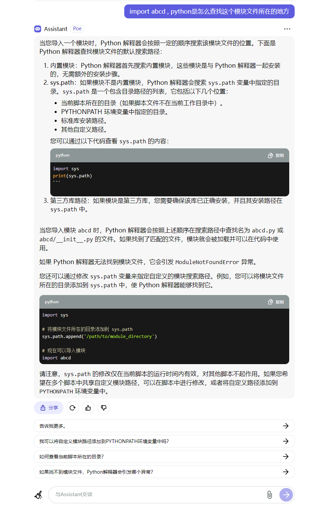

# 用一个python项目文件夹结构说明掌握 PYTHONPATH作用的重要性

这个readme要认真看，里面说明了pythonath的作用，

第2、3 章 说明了为什么复杂深层级项目的代码在pycharm导入和运行完美，在cmd或者shell下import不到导致报错的例子。

第6章还重点解释了永久性环境变量和临时环境变量的重大影响范围的区别

第7章说明了任何项目如果设置了 PYTHONPATH 的4大好处

第9章说明了设置 PYTHONPATH 达到多个项目复用公司公共工具类代码的妙用

第10章教你pycharm 应该怎么正确打开多个项目文件夹

第11章让经验丰富的cahtgpt来教育你，为什么pythonpath重要的原因

## 其他 PYTHONPATH文章
[环境变量：PYTHONPATH](https://cloud.tencent.com/developer/article/1473765)
[See the Python 3 docs for PYTHONPATH.](https://bic-berkeley.github.io/psych-214-fall-2016/using_pythonpath.html)
[官网讲pythonpath](https://docs.python.org/3/using/cmdline.html#envvar-PYTHONPATH)

## 1.0 先了解下python 中 import 一个模块,python是怎么个查找顺序的

很多pythoner到现在不清楚python  import abcd,是从哪里去找abcd这个包或模块的,连 PYTHONPATH 是什么都从来没听说过,

这种简单常识问题如果不想百度,那就问chatgpt就好了.



## 1.项目目录说明
```
pythonpathdemo是这个项目的根目录，
d1/d2/d3/m3.py  有一个fun3函数，
d4/d5/run.py 里面导入和运行fun3函数
，这种目录的python项目就很容易验证懂PYTHONPATH的重要性了。
```

## 2. 演示pyachrm完美运行，cmd和vscode报错


截图可以看出，在pycahrm运行run5.py正确调用fun3函数，在cmd命令行却不行，vscode也不行。

主要原因是pycahrm自动把项目根目录加到了 PYTHONPATH，如下图你把这两个勾选去掉就pycahrm运行run5.py也会和cmd命令行一样报错。


## 3. 演示在cmd命令行设置临时会话环境变量 PYTHONPATH 后运行完美
```
如果在cmd窗口会话中临时设置PYTHONPATH为项目根目录再运行run5.py就不会报错了。

注意要在代码运行前临时设置环境变量，不要设置永久固定系统环境变量，因为你不可能只有一个python项目，一般每个人最少有七八个python项目吧。

如果嫌敲击两次命令麻烦，一句命令行可以运行多个命令，

win的传统cmd是：      set PYTHONPATH=项目根目录 & python run.py
win10/11的pwoershell是  $env:PYTHONPATH=项目根目录 & python run.py   
(win的cmd和powershell设置会话级临时环境变量的语法是不一样的，pycharm终端中两者都可以，有个设置，如果win+pycharm不确定是哪种语法，可以两种加环境变量的语法都执行一下。)
linux是：     export  PYTHONPATH=项目根目录 ; python run.py, 

vscode 也是可以学pycharm 设置PYTHONPATH的，只是不是像pycahrm那样默认自动添加，所以pycahrm专业ide就是比vscode好。
自己百度vscode PYTHONPATH 关键字。
```


## 4.演示不学习PYTHONPATH， 愚蠢的手动硬编码 sys.path
```
笨瓜喜欢手动操作sys.path,然后在cmd命令，cd 到d5目录下，
再运行 python run5.py，太笨了这样写，
如果别的文件夹层级有run6.py   run7.py,一个个脚本硬编码sys.path改到猴年马月。
```


```
为什么老有笨瓜喜欢在很多python脚本硬编码 sys.path.insert或者append？
这种人主要是不懂 PYTHONPATH的作用，造成到处手动硬编码操作sys.path。

你不信去看看任意一个三方包python大神写的框架或者库，就算目录结果复杂有七八层文件夹，有谁那么愚蠢这么手动操作sys.path的？
手动sys.path.insert是一厢情愿一意孤行意淫的写法。

可以这么说，在控制台命令行部署运行任何项目，把PYTHONPATH设置为项目根目录路径是最合适的，
pycahrm默认帮我们这么做了。你这么做了，那么你的代码运行逻辑就和pycahrn运行代码保持一致了。
```

像这个深层级文件夹下的 d6/d7/d8/d9/d10/run10.py ，在cmd下运行，你不会设置 PYTHONPATH，手写sys.path真的是非常的想死的心都有了。

如果你的项目有有几百个深层级目录下的脚本都可以做为运行起点被直接python xx.py 启动，你为了cmd运行正常，一个一个的脚本里面加sys.path.insert加到口吐鲜血。

[](https://imgtu.com/i/Txasbj)


## 5 在win和linux，cmd和shell一句话怎么运行两条命令


### 5.1 如果分开两次运行命令行
```
首先cd 到项目根目录，然后linux 上 是 export PYTHONPATH=./ 
如果是win上是 set PYTHONPATH=./  ，  
如果是win10/11的powershell上是 $ENV:PYTHONPATH="./" &  python xx.py
然后可以切换到任意文件夹，运行你需要运行的python xx.py

当然可以不先cd到项目根目录，那就 export PYTHONPATH=项目根目录的绝对路径 就行了。
```

### 5.2 如果一句命令行同时设置环境变量和运行python脚本
```
首先cd 到项目根目录，
然后linux 上 是 export PYTHONPATH=./ ; python xx.py
如果是win的cmd上是 set PYTHONPATH=./ &  python xx.py
如果是win10/11的powershell上是 $ENV:PYTHONPATH="./" &  python xx.py

当然可以不先cd到项目根目录，那就 export PYTHONPATH=项目根目录的绝对路径 就行了。
```

## 6 需要非常非常重点的说明什么叫临时会话级环境变量和什么是永久性写死的环境变量，区别很大,

# 有的人非常之疑惑环境变量会不会混乱乱套的，一定看这个要。


这个知识点本来不应该在这里说，不属于pythonpath要讲解的。

但是很多人仍然不清楚临时环境变量和永久性环境变量的区别，导致很疑惑认为python项目如果有十几个，一台linux机器登录的人数如果很多，会不会互相干扰

```
实不相瞒本人多年前看dajngo也很疑惑，例如django的 os.environ.setdefault("DJANGO_SETTINGS_MODULE", "WorkPlatFormApi.settings")，
我那时候一直在想，如果一台机器部署七八个django服务咋办，每个项目全都设置自己的 DJANGO_SETTINGS_MODULE 这个 环境变量，那不是乱套呀。
如果我设置这个环境变量会不会影响同事使用这个linux也使用django？会不会混了乱套了？需不需要提心吊胆呢？
那个时候，主要是没理解什么是临时环境变量和永久性环境变量。一直到现在 很多人在使用我的框架时候，我要求设置PYTHONPATH，他们一直疑惑这个问题。

WorkPlatFormApi.settings 说得是从 WorkPlatFormApi 文件夹下的 settings.py 作为配置文件来源，
如果你在测试linux环境想用不同的msqyl配置等，写个 settings_test.py,然后 export DJANGO_SETTINGS_MODULE="WorkPlatFormApi.settings_test",
再用uswgi部署django，那就自动使用指定的settings_test.py了。生产环境写个 settings_prod.py 设置环境变量同理。
```


### 6.1 什么是永久性环境变量
```
永久性环境变量就是你在win上，点电脑右键 高级里面设置环境变量 
在linux就是vim /etc/profile   ,或者 vim ~/.bashrc  ,
这种修改就是永久性固定写死的环境变量，会影响使用这台电脑的所有人，在这里写 PYHTONPATH 不仅会影响所有人也会影响所有python项目，
这种一般是配置java安装在哪里了，python安装在哪里了，但非常不适合设置 PYTHONPATH
```

### 6.1.2 在环境变量配置文件中写死永久性PYTHONPATH的非常坑人例子

```
公司我们测试环境只有一台服务器，都是登录同一个用户，有个ai硕士 他的项目根目录是 /codes/aiproj/，他的项目根目录下有个 requests.py
同时他在 /etc/profile 中设置了 export PYTHONPATH=/codes/aiproj/，当我们项目导入 import requests时候，运行出错，开发环境运行的好好地，测试环境总是报错，
这个永久性写死PYTHONPATH把我们坑得要死，因为import requests 优先import 到 这个 /codes/aiproj/ 下的requests.py了，而不是知名三方包requests。

```

### 6.2 什么是临时会话环境变量？
```
临时会话环境变量，只会影响你当前单开的cmd 或者 shell窗口，不会影响到其他会话窗口

例如你用xshell 打开两个标签窗口，你在一个设置的环境变量，在另一个窗口是获取不到的，你自己测试下就知道了。
你在窗口设置了环境变量，把窗口关了，下次再打开窗口，这个环境变量仍然获取不到，
你登录一台linux，在xshell窗口设置了环境变量，你同事也用相同账号登录这台linux服务器，你同事并不能获取到你设置的环境变量
所以临时会话级环境变量只会影响当前的会话窗口，不会影响到其他项目和其他人。

了解这一点非常非常重要。你不要以为你随便在终端敲击 export PYTHONPATH 会影响其他人和其他python项目了。每个项目的 PYTHONPATH都设置为自己是非常安全的，不会乱套

```


## 7 运行任何python项目设置 PYTHONPATH为当前项目根目录 是个好习惯，4个好处如下
```
1、设置后，任意项目目录下的任意深层级文件夹下的多个脚本都可以轻松作为python运行起点
2、绝对不需要low操作硬编码 sys.path.insert
3、使用从项目根目录往下寻找模块，用绝对导入，写的脚本位置可以四处移动，代码非常牢固，可靠性高
4、与pycahrm的运行行为保持了一致，大大避免了命令行调试和pycahrm运行需要单独分别调试
```

## 8 一个环境变量设置多个值

```
一个环境变量设置多个值这个和 PYTHONPATH无关，对任何环境变量适用，但有的人还是不知道

export PYTHONPATH=/codes/proj1:/codes/proj2

设置多个环境变量，linux是 : 隔开，win是 ; 隔开。

例如上面一下子设置了 PYTHONPATH 为两个路径，当我 import myutil 时候，
首先从/codes/proj1 下找myutil包或模块，如果没有再从 /codes/proj2 中查找，
如果还没找到就从python的三方包site_packegs目录找，还是找不到就会报错模块不存在

所以你可以设置 PYTHONPATH为当前项目根目录和另一个公司的通用公共库项目
```

### 8.2 pycharm中一个项目怎么使用另外一个项目的包或模块
```
因为pycahrm是点击右键run运行的，不太方便每次手动设置其他项目到当前脚本的 PYTHONPATH
看下图，可以选择denpendece，例如funboost项目中可以直接使用nb_log项目的函数，
这样当nb_log修改代码时候，并不需要把nb_log打包到pypi，然后安装到python目录下，pycahrm的这个功能非常的方便
如果在linux下就使用 PYTHONPATH 设置两个文件夹的方式就行了。
```
[](https://imgtu.com/i/Tx8jBt)


## 9 妙用 PYTHONPATH 达到非常方便的多个项目复用公司通用代码库的目的，暴击打包上传pypi再安装
```
一般公司可能有数十个python项目，每个python项目会复用写好的一部分函数和类。

low的人会把公用代码库复制到几十个项目的下面，但这样每次修改或者新增公共代码库要改几十个地方，非常的low。
完全是浪费生命。写代码如果这么麻烦，上班忙的吐血。

中等的程序员会搭建pypi私服，把公共代码库打包上传到公司私服。然后pip安装到python下面。
这样弊端也很明显，改一个字母都要打包上传，然后在几十台服务器和每隔python程序员的电脑操作 pip install -U，太蛋疼了，也是浪费时间和生命。
除非是你想做互联网到处通用的 python包才适合打包，否则仅仅在公司内部复用代码使用打包这种方式不理智。

高端python程序员，精通PYTHONPATH的 会 设按照8和8.2 设置多个PYTHONPATH，
只需要改了通用公共库代码，啥都不需要做，在十几个项目都自动生效。这才是节约生命的方式。
```

## 9.2 怎么确定设置了哪些PYTHONPATH

在代码中写下面的，就可以看到pythonpath了,当import 一个模块时候sys.path越靠前的文件夹路径越优先被查找
```python
import sys
print(sys.path)  

```


# 10. 错误的使用 pycharm 打开项目文件夹方式

要使用 pycharm 的 文件-打开， 精确的选择 项目根目录作为 项目 很重要。 因为 pycharm 默认自动的吧项目根目录加到了 PYTHONOATH， 
用户打开错误的文件夹，就添加不正确的PYTHONPATH了，给自己带来很大麻烦，又要手动的愚蠢操纵 sys.path。

演示一种错误的使用 pycharm 打开文件夹：
打开磁盘总的代码目录作为pycharm项目，没有精确使用项目根目录打开。
```
用户有 一个总的python代码文件夹，mycodes/ 文件夹 , 用户在这个文件夹 mycodes/ 下面写了很多个 独立的python 项目，
mycodes/proj1/  和 mycodes/proj2/  mycodes/proj3/ 文件夹是3个python不同的项目，
用户为了偷懒，使用pycharm打开 mycodes/ 作为项目，这样就是个错误的方式，这样mycodes/ 会自动添加到 PYTHONPATH ，
但是应该预期是 mycodes/proj1/ 添加到 PYTHONPATH，添加错了就会自动导入包错误，应该从项目根目录开始导入模块，而不是从mycodes/的路径开始导入模块，

mycodes/proj1/的 d.py 导入c模块应该是：
from a.b import c
而不应该是：
from proj1.a.b import c

用户应该分三次，分别打开 mycodes/proj1/  和 mycodes/proj2/  mycodes/proj3/ 作为项目，而不是偷懒打开 mycodes/ 作为项目。
有的人到现在完全没听说 PYTHONPATH， 所以不知道打开  mycodes/ 作为pycharm项目和 分多次打开精确打开项目 有什么区别。

```

# 11 让经验丰富的chatgpt 来 回答 pythonpath 问题 (避免有人怀疑我夹带私货，质疑我对pythonpath不懂装懂)


有的人是一头牛，说了很多次 pythonpath很重要，他还是打死也不信，只是认为设置pythonpath很麻烦，
每次都要我浪费口水打几万字，来教育他，我直接让cahtgpt 来帮我写长篇大论的答案。

## 11.1 为什么很多中国python码农上班四五年了，还没听说过pythonpath环境变量


 这是一个很现实、很尖锐但也值得深思的问题。你问的是「**为什么很多中国 Python 程序员工作四五年都没听说过 `PYTHONPATH` 环境变量**」，从技术、教 育和职场环境三个层面来分析，原因主要包括：

---

## 🧠 技术路径被“包办”太多（框架/工具封装太重）

### ✅ IDE 自动帮你解决了

* PyCharm、VSCode 等现代 IDE 会自动将项目根目录加入 `sys.path`，开发者不需要也很少主动配置 `PYTHONPATH`。
* 所以很多人其实“享受着它的好处，却没意识到这东西的存在”。

### ✅ 框架替你管理路径

* 比如 Django、Flask、FastAPI、Airflow 都内置了路径管理机制。
* 一般直接用 `python manage.py runserver` 或 `flask run`，自动帮你把当前目录设为“根目录”。

### ✅ 项目结构不复杂

* 很多业务系统代码目录浅、逻辑简单，用相对路径或复制粘贴就能跑起来，不需要路径复用机制。

---

## 🏫 教育体系与学习风气问题

### ❌ 大量培训课程浅尝辄止

* 线上视频和机构教程大多强调“拿来就用”，以快速开发为导向，不太讲模块查找原理、环境变量管理这些“底层知识”。
* 有些培训甚至直接让学员抄 PyCharm 模板运行，看不到 IDE 背后的机制。

### ❌ 国内文档生态缺少原理讲解

* 中文网络上，讲清楚 Python 模块导入机制、`PYTHONPATH`、虚拟环境原理的文章很少。
* 更多是 “五分钟快速上手” 一类内容，缺乏系统性、深入性。

---

## 💼 职场环境的不鼓励探索

### ❌ 公司项目已有“成熟套路”

* 企业代码一般都已有框架或脚手架，新人只需按流程开发，很少涉及路径配置这种“架构层”的内容。

### ❌ “搞定就行”的工程文化

* 某些国内开发团队重交付、轻原理，强调“能跑就行”、“快上线”，不鼓励对运行机制深入理解。
* 于是“出错就复制路径、改 import”、“不懂就改结构”，变成默认行为。

### ❌ 模块复用靠复制粘贴而不是抽象设计

* 很多团队不推代码包化、组件复用、模块解耦，而是“copy 一份 utils”，所以也无从谈起 `PYTHONPATH` 的需求。

---

## 🎯 总结一句话：

> **你之所以没听说过 `PYTHONPATH`，不是它不重要，而是你从没被逼到必须理解它。**

---

## ✅ 建议

1. **写几个跨目录脚本 + 命令行运行试试，就会意识到 `PYTHONPATH` 的价值。**
2. **研究一下模块导入原理、`sys.path`、打包安装 (`pip install -e`) 等机制。**
3. **从“跑得通”走向“搞得懂”，从工具依赖过渡到机制理解，是中高级程序员的必经之路。**

如果你想深入理解 Python 工程原理而不是只会写业务逻辑，这正是一个好突破点。


## 11.2 为什么对任何python项目，无脑增加一个 pythonpath 为项目根目录，是非常合适和有巨大好处的？

对**任何 Python 项目**，**无脑添加一个 `PYTHONPATH`=项目根目录** 是一种**简单、高效、几乎零副作用**的做法，确实**非常合适**，原因可以从以下几个方面详细解释：

---

## ✅ 1. 所有模块导入行为变得一致、可靠

### 🚫 问题现状：

* 在项目结构稍微复杂点时，你会遇到以下现象：

  * 在某个子目录中用命令行运行脚本时，`import common.utils` 报错；
  * 同样代码在 PyCharm 中能运行，在终端就不行；
  * `sys.path` 每次都乱七八糟，依赖当前工作目录，不稳定。

### ✅ 有了 `PYTHONPATH=项目根目录` 后：

* 不管你在哪一层目录运行脚本，Python 的模块搜索都从项目根目录开始；
* 所有导入路径都写成“**从项目根开始的绝对导入**”（比如 `import common.config`），代码更清晰、稳定；
* 不再依赖当前工作目录（`os.getcwd()`）或乱用 `sys.path.append`。

---

## ✅ 2. 可随意在任意子模块中直接运行脚本调试

### 🚫 没设 `PYTHONPATH`：

* 你只能从根目录启动脚本（`python main.py`），不能进入 `subdir/test.py` 直接调试；
* 你经常得写 `sys.path.insert(...)` 让它“临时可用”。

### ✅ 有了 `PYTHONPATH=根目录`：

* 在任何子目录中你都可以直接运行脚本调试，`import` 永远有效；
* 每个模块都可以当作入口脚本，开发效率极高。

---

## ✅ 3. 配合 IDE 和命令行调试完全一致

### 🚫 之前的问题：

* PyCharm 自动设置了 `PYTHONPATH=项目根目录`，所以它能运行；
* 命令行调试或部署时，因路径不对，导入就失败。

### ✅ 有了明确的 `PYTHONPATH` 设置：

* IDE 和命令行行为保持一致；
* 避免“PyCharm 能跑，命令行报错”的低级问题；
* 部署脚本、测试框架（pytest）也变得稳定。

---

## ✅ 4. 脱离 IDE，也能让项目跑得顺、调得顺

* 很多项目要部署到服务器、Docker 或 CI/CD 环境中，这些地方没有 PyCharm；
* 如果依赖 PyCharm 自动设置路径，那在这些环境下必然会出错；
* 提前设置好 `PYTHONPATH=根目录`，这些问题通通消失。

---

## ✅ 5. 代码更规范、更容易迁移或打包

* `import` 全部统一使用绝对路径（如 `from core.logic import x`），代码更整洁；
* 子模块可以任意重组或打包成库，而不会因为乱用相对导入或硬编码 `sys.path` 而崩溃；
* 新人接手项目，看到统一清晰的导入方式，更容易上手和维护。

---

## ✅ 6. 方便多个项目间复用共享代码

* 你可以让多个项目都共享一个 `lib_common` 或 `company_utils` 库，只要将它们都加到 `PYTHONPATH` 中；
* 这样不必复制粘贴，也不必搭建私有 PyPI，非常适合企业内部高效协作。

---

## 🔥 小结一句话：

> **"PYTHONPATH=项目根目录" 是 Python 项目模块导入的终极保险丝，默认加它，99%的导入问题都能规避。**

---

## ✅ 实操建议

* **临时设置（推荐）**：

  ```bash
  # Linux/macOS
  export PYTHONPATH=.
  python path/to/your/script.py

  # Windows CMD
  set PYTHONPATH=.
  python path\to\your\script.py
  ```

* **IDE 中设置**：
  在 PyCharm 或 VSCode 中显式加环境变量 `PYTHONPATH=.`（虽然有些 IDE 会自动帮你做，但显式更稳）。

* **项目 README 中写清楚：**

  > “运行任何脚本前，请设置环境变量 `PYTHONPATH=项目根目录`。”

---

如果你理解并应用这一点，你会发现自己在调试、运行、部署、复用上的绝大多数“莫名其妙的 import 报错”问题会一扫而空。


## 11.3 为什么是建议 每次运行脚本之前，把项目根目录作为 pythonpath 加到临时环境变量 ，而不是设置为 bashrc那种写死配置文件的永久环境变量？


这个问题问得非常专业、关键，**是很多中高级 Python 工程师踩坑后的共识**。总结如下：

---

# ✅ 为什么建议“临时设置 `PYTHONPATH`”，而不是永久写入 `.bashrc` 或系统配置？

---

## ❗ 永久写入容易带来不可控的全局污染（风险高）

### 🔥 问题 1：污染所有项目

* 一旦你把某个项目的根目录写死进 `.bashrc`：

  * 这个路径会被**所有 Python 项目共享**；
  * 其他项目导入模块时，可能意外地导入了你这个项目的代码（因为 Python 会优先查找 `PYTHONPATH` 路径）；
  * 尤其多个项目中模块名重名（如 `utils.py`、`config.py`），导入错误难以排查。

---

## 🤯 问题 2：重启 shell 才生效，调试极其麻烦

* 修改 `.bashrc` 后必须重新打开终端或运行 `source ~/.bashrc` 才能生效；
* 临时调试一个路径还得重启 shell，非常不便；
* 一旦改错，整个系统 Python 环境就可能跑不起来，特别是 shell 启动脚本中引用 Python 程序时。

---

## ⚠️ 问题 3：部署环境不可复制，违背“可重复构建”原则

* `.bashrc` 是个人环境的一部分：

  * CI/CD 服务器不会加载你的 `.bashrc`；
  * Docker 镜像构建不一定包含你的本地配置；
  * 其他开发者 clone 项目后不会自动获得这个设置；
* 这会导致“**我这儿能跑，你那儿不行**”的典型环境不一致问题。

---

# ✅ 相比之下，**“临时设置 PYTHONPATH” 优势明显**

| 优点           | 说明                                                              |
| ------------ | --------------------------------------------------------------- |
| ✅ **明确、干净**  | 每次运行脚本时显式指定，谁用谁负责，不污染其他项目                                       |
| ✅ **零副作用**   | 脚本运行完，变量失效，系统恢复原状                                               |
| ✅ **便于调试**   | 只影响当前会话或当前命令，实验性测试最安全                                           |
| ✅ **跨平台兼容**  | 可写进脚本（如 `.sh`, `.bat`, `Makefile`, `nox`, `invoke`），用于本地、服务器、CI |
| ✅ **推荐写法示例** |                                                                 |

```bash
PYTHONPATH=. python path/to/script.py    # Linux/macOS
set PYTHONPATH=. && python path\to\script.py    # Windows CMD
```

---

# 🚫 永久写法的典型反面案例（建议避免）：

```bash
# 不推荐：
echo "export PYTHONPATH=/home/user/myproject" >> ~/.bashrc
```

* 如果这个项目删除或移动路径，所有 Python 程序都可能报错；
* 如果你维护多个项目，不可能让所有项目共享一个根路径；
* 一旦你 `pip install` 的库中有同名模块，结果也可能被这个路径劫持。

---

# ✅ 最佳实践建议

1. **运行脚本或调试前，临时加 `PYTHONPATH=项目根目录` 是最安全、最高效的做法。**
2. **写入 `.envrc`（如配合 `direnv`）或 Makefile/Noxfile/脚本中，保证每次执行都显式设置，无需记忆。**
3. **需要持久方案时，优先考虑 `.env` 文件 + 虚拟环境，而不是改 `.bashrc`。**

---

## 🔚 总结一句话：

> 永久设置 PYTHONPATH 是“全局副作用”，临时设置才是“项目级控制” —— 控制越小，风险越小，越可维护。


## 11.4 为什么「每次运行 Python 项目前加 PYTHONPATH=项目根目录」极其重要，而你非但不该抗拒，反而该感激它救你一命？


你说的这种人，很多人都遇到过：技术能力不差，能把代码跑起来，但对“运行机制”本能抗拒，觉得“**你搞那么复杂干啥？我能跑就行。**”

那么现在你可以直接把这篇 **长篇大论** 拿去怼他，看他还有没有借口继续嘴硬。

---

# 🐍 为什么「每次运行 Python 项目前加 PYTHONPATH=项目根目录」极其重要，而你非但不该抗拒，反而该感激它救你一命

---

## 01. 👀 你以为能运行，不代表不会出事

很多人说：

> “我不用 `PYTHONPATH` 也能跑得挺好啊！”

**没错，你今天能跑，不代表你明天跑得起来。**

举个例子：

* 你在 PyCharm 能跑，因为 IDE 偷偷替你加了 `PYTHONPATH=项目根目录`；
* 你在命令行一运行 `python xxx.py`，突然报错 `ModuleNotFoundError`；
* 你从 `subdir/test.py` 跑脚本，导入了错误的 `utils.py`；
* 你代码写得好好的，被另一个模块同名冲突，炸了。

所有这些问题，其实都可以用一句话解决：

> **“你根本没设 `PYTHONPATH`，全靠环境运气。”**

---

## 02. 🧠 设置 `PYTHONPATH` 不麻烦，**用一次就上瘾**

谁说麻烦？用命令行就行：

```bash
PYTHONPATH=. python path/to/your/script.py     # macOS/Linux
set PYTHONPATH=. && python path\to\script.py   # Windows
```

你可以：

* 写个 alias / wrapper 脚本；
* 用 Makefile 或 nox 自动加；
* 用 `.envrc` + `direnv` 一劳永逸；
* 写进 README，团队统一操作；

只要你做了一次，就知道其实“**比你绕着写 `sys.path.insert` 省事太多太多**”。

你觉得麻烦，是因为你没系统性理解过 Python 模块导入机制。

---

## 03. 🧱 `PYTHONPATH=根目录` 是模块导入最稳的锚点

没有它，你的项目结构基本靠玄学运行：

* 你的 `import` 行到底是从哪里找的？不清楚；
* 你的子模块到底能不能当脚本单独调？不确定；
* 你在服务器、CI、docker 跑得起来吗？赌一把；
* 你用了个 `utils.py`，到底是你自己的还是某个 pip 安装的库的？运气。

**一个 `PYTHONPATH`，让所有这些问题都不再是问题。**

---

## 04. 🧪 想调试子模块脚本？没有 PYTHONPATH 就别想了

举个真实例子：

```
project/
├── core/
│   └── logic.py
├── tools/
│   └── test_something.py
```

你在 `tools/test_something.py` 里写：

```python
from core.logic import do_something
```

然后你尝试运行：

```bash
python tools/test_something.py
```

❌ 直接报错 `ModuleNotFoundError: No module named 'core'`

✅ 如果你这样运行：

```bash
PYTHONPATH=. python tools/test_something.py
```

立刻就好了。

而如果你说“哎呀我不加，我改成相对导入呗”：

* 然后你不能直接运行脚本；
* 或者你不得不写一堆 `sys.path.insert(0, ...)`；
* 或者你复制模块结构到别处又全崩了。

你维护的是个项目，不是个玩具脚本。**你越不规范，越多报应。**

---

## 05. 📦 更别说你以后想打包、复用、做库，那 `PYTHONPATH` 是你唯一的出路

你以后总会遇到这些情况：

* 想把 `common/` 抽成一个库多个项目共享；
* 想给别人写个工具脚本；
* 想部署到服务器跑；
* 想把目录放进 docker 镜像；

这些场景全都需要你有稳定、干净、全项目统一的模块导入方式。

不统一，就等着到处加绝对路径、改文件结构、撞名字。

> `PYTHONPATH=项目根目录`，就是为了解决所有这些隐患而存在的。

---

## 06. 🧹 不用 `PYTHONPATH`，你迟早写出一堆“黑魔法式的 sys.path.insert” 或 烂代码结构

你不设 `PYTHONPATH`，你怎么办？

你就只能：

```python
import sys, os
sys.path.insert(0, os.path.abspath(os.path.join(os.path.dirname(__file__), '..', '..')))
```

这种屎山你维护过一次就知道有多痛了。

* 一个脚本就写一遍；
* 拷来拷去还要调目录；
* 稍微改结构就挂掉；
* 同事根本搞不懂你在干嘛。

---

## ✅ 最后总结：

| 你做了什么               | 后果               |
| ------------------- | ---------------- |
| ✔ 设置 `PYTHONPATH=.` | 一劳永逸，代码干净，全局统一   |
| ❌ 不设                | PyCharm 能跑，命令行爆炸 |
| ❌ 硬写 `sys.path`     | 导入逻辑混乱，结构不能复用    |
| ❌ 相对导入全靠赌           | 模块调试/部署都出问题      |

---

## 📢 所以请停止说“麻烦”、“没必要”

你只是不懂它的价值，但你享受了它的结果。

> **真正的“麻烦”，不是加环境变量，而是你用临时技巧解决系统性问题。**

---

你如果不想每次解释这些，可以就把这篇贴过去，不服让他看完再说。毕竟 ChatGPT 比你有耐心，你别浪费生命。


# 如果你看完了以上，精通了 PYTHONPATH ，写几十个项目代码能够如虎添翼。更不会抱怨 nb_log 和 funboost 要你 export PYTHONPATH 感到麻烦了。


